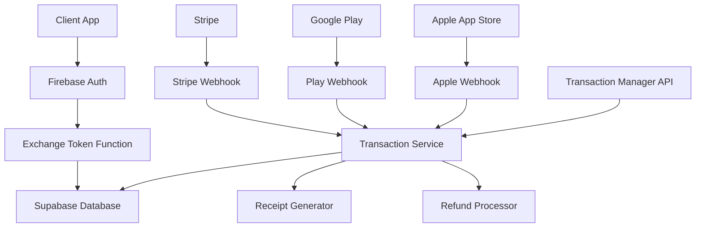
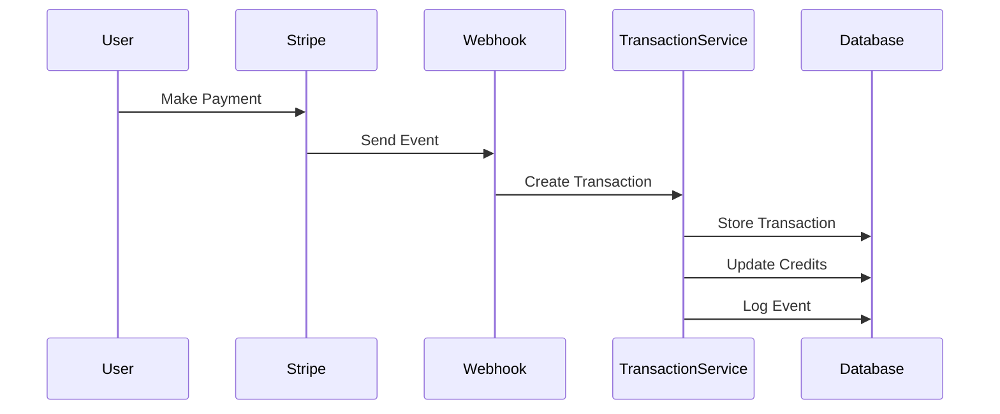

# Payment System Documentation

The Clanker app implements a comprehensive multi-tenant payment system supporting subscriptions, one-time purchases, and transaction tracking across multiple payment providers.

## Table of Contents

1. [Overview](#overview)
2. [Architecture](#architecture)
3. [Subscription Tiers](#subscription-tiers)
4. [Transaction Tracking](#transaction-tracking)
5. [API Reference](#api-reference)
6. [Frontend Integration](#frontend-integration)
7. [Webhook Setup](#webhook-setup)
8. [Development Guide](#development-guide)
9. [Troubleshooting](#troubleshooting)

## Overview

### Key Features

- **Multi-tier subscriptions** with unlimited and credit-based plans
- **One-time credit purchases** for flexible usage
- **Real-time credit tracking** without JWT staleness
- **Multi-tenant support** for multiple applications
- **Comprehensive transaction logging** with audit trails
- **Receipt generation** for all purchases
- **Refund management** with approval workflows
- **Multi-provider support** (Stripe, Google Play, Apple App Store)

### Credit System

Users can obtain credits through three methods:

1. **Free tier**: 50 credits on first login
2. **Subscriptions**: Monthly credit allowances or unlimited usage
3. **One-time purchases**: Direct credit top-ups

## Architecture

### System Components



### Database Schema

#### Core Tables

**`user_app_subscriptions`**

```sql
- user_id: UUID (Foreign Key)
- app_name: TEXT (Multi-tenant identifier)
- plan_tier: TEXT (unlimited, credits_100, credits_1000, etc.)
- plan_status: TEXT (active, cancelled, expired)
- credits_remaining: INTEGER
- plan_renewal_at: TIMESTAMP
- billing_provider_id: TEXT (Stripe subscription ID)
```

**`user_transactions`**

```sql
- id: UUID (Primary Key)
- user_id: UUID (Foreign Key)
- app_name: TEXT
- transaction_id: TEXT (Internal ID)
- external_transaction_id: TEXT (Provider ID)
- provider: TEXT (stripe, google_play, apple_app_store)
- transaction_type: TEXT (subscription, one_time, refund)
- amount_cents: INTEGER
- currency: TEXT
- status: TEXT (pending, completed, failed, refunded)
- provider_metadata: JSONB
- internal_metadata: JSONB
- receipt_data: JSONB
```

**`user_transaction_refunds`**

```sql
- id: UUID (Primary Key)
- transaction_id: UUID (Foreign Key)
- refund_amount_cents: INTEGER
- refund_reason: TEXT
- status: TEXT (requested, processing, completed, failed)
- provider_refund_id: TEXT
- requested_by_user_id: UUID
- requested_by_admin_id: UUID
```

**`transaction_events`**

```sql
- id: UUID (Primary Key)
- transaction_id: UUID (Foreign Key)
- event_type: TEXT
- event_source: TEXT (stripe_webhook, google_api, manual)
- event_data: JSONB
- raw_event_data: JSONB
- processing_status: TEXT (success, failed, skipped)
```

## Subscription Tiers

### Available Plans

| Plan          | Price | Credits | Billing  | Description                   |
| ------------- | ----- | ------- | -------- | ----------------------------- |
| **Free**      | $0    | 50      | One-time | Initial credits for new users |
| **Basic**     | $3    | 100     | One-time | Credit top-up package         |
| **Pro**       | $20   | 1000    | One-time | Large credit package          |
| **Unlimited** | $50   | ∞       | Monthly  | Unlimited AI generations      |

### Plan Configuration

Plans are configured in Firebase Remote Config:

```json
{
  "PRICE_ID_TO_TIER": {
    "price_stripe_unlimited_monthly": "unlimited",
    "price_stripe_credits_100": "credits_100",
    "price_stripe_credits_1000": "credits_1000"
  },
  "PRODUCT_ID_TO_APP": {
    "prod_stripe_yours_brightly": "yours-brightly"
  }
}
```

## Transaction Tracking

### Automatic Transaction Creation

Transactions are automatically created for:

1. **Subscription payments** (monthly billing cycles)
2. **One-time credit purchases** (individual top-ups)
3. **Refunds** (full or partial)
4. **Chargebacks** (disputed payments)

### Transaction Lifecycle



### Event Tracking

All payment events are logged with:

- **Event type** (payment.succeeded, subscription.created, etc.)
- **Event source** (stripe_webhook, google_api, manual)
- **Event data** (processed information)
- **Raw event data** (original provider payload)
- **Processing status** (success, failed, skipped)

## API Reference

### Transaction Manager Cloud Function

Base URL: `https://transactionmanager-[hash]-uc.a.run.app`

#### Create Transaction

```http
POST /?action=create
Content-Type: application/json

{
  "user_id": "uuid",
  "app_name": "yours-brightly",
  "provider": "stripe",
  "transaction_type": "one_time",
  "amount_cents": 300,
  "currency": "USD",
  "external_transaction_id": "pi_stripe_payment_intent_id",
  "provider_metadata": {
    "stripe_customer_id": "cus_customer_id",
    "payment_intent_id": "pi_payment_intent_id"
  },
  "internal_metadata": {
    "product_name": "Credits (100)",
    "credit_amount": 100
  }
}
```

#### Get Transaction

```http
GET /?action=get&transaction_id=txn_12345
```

#### List User Transactions

```http
GET /?action=list&user_id=uuid&app_name=yours-brightly&limit=50&offset=0
```

#### Request Refund

```http
POST /?action=request-refund
Content-Type: application/json

{
  "transaction_id": "txn_12345",
  "refund_amount_cents": 300,
  "refund_reason": "Customer request",
  "refund_type": "full",
  "requested_by_user_id": "uuid"
}
```

#### Generate Receipt

```http
POST /?action=generate-receipt
Content-Type: application/json

{
  "transaction_id": "txn_12345"
}
```

### Response Format

All API responses follow this format:

```json
{
  "success": true,
  "data": {
    // Response data
  }
}
```

Error responses:

```json
{
  "success": false,
  "error": "Error message"
}
```

## Frontend Integration

### React Hook for Credits

```typescript
// hooks/useUserCredits.ts
import { useQuery } from '@tanstack/react-query'
import { getUserCredits } from '../services/creditsService'

export const useUserCredits = (userId: string, appName: string) => {
  return useQuery({
    queryKey: ['userCredits', userId, appName],
    queryFn: () => getUserCredits(userId, appName),
    refetchInterval: 30000, // Refetch every 30 seconds
    staleTime: 10000, // Consider data stale after 10 seconds
  })
}
```

### Credit Counter Component

```typescript
// components/CreditCounterIcon.tsx
import React from 'react';
import { useUserCredits } from '../hooks/useUserCredits';
import { useAuth } from '../hooks/useAuth';

export const CreditCounterIcon: React.FC = () => {
  const { user } = useAuth();
  const { data: credits, isLoading } = useUserCredits(user?.id, 'yours-brightly');

  if (isLoading) return <div>Loading...</div>;

  return (
    <div className="credit-counter">
      <span>{credits?.remaining || 0}</span>
      <span>credits</span>
    </div>
  );
};
```

### Subscription Button Component

```typescript
// components/SubscriptionButton.tsx
import React from 'react';
import { createStripeCheckout } from '../services/stripeService';

interface SubscriptionButtonProps {
  priceId: string;
  planName: string;
  userId: string;
}

export const SubscriptionButton: React.FC<SubscriptionButtonProps> = ({
  priceId,
  planName,
  userId
}) => {
  const handleSubscribe = async () => {
    try {
      const { url } = await createStripeCheckout({
        priceId,
        userId,
        successUrl: `${window.location.origin}/success`,
        cancelUrl: `${window.location.origin}/cancel`
      });
      window.location.href = url;
    } catch (error) {
      console.error('Subscription error:', error);
    }
  };

  return (
    <button onClick={handleSubscribe}>
      Subscribe to {planName}
    </button>
  );
};
```

### Transaction History Component

```typescript
// components/TransactionHistory.tsx
import React from 'react';
import { useQuery } from '@tanstack/react-query';
import { getUserTransactions } from '../services/transactionService';

export const TransactionHistory: React.FC<{ userId: string }> = ({ userId }) => {
  const { data: transactions, isLoading } = useQuery({
    queryKey: ['transactions', userId],
    queryFn: () => getUserTransactions(userId, 'yours-brightly')
  });

  if (isLoading) return <div>Loading...</div>;

  return (
    <div className="transaction-history">
      <h3>Transaction History</h3>
      {transactions?.map(transaction => (
        <div key={transaction.id} className="transaction-item">
          <div>{transaction.transaction_type}</div>
          <div>${(transaction.amount_cents / 100).toFixed(2)}</div>
          <div>{transaction.status}</div>
          <div>{new Date(transaction.created_at).toLocaleDateString()}</div>
        </div>
      ))}
    </div>
  );
};
```

## Webhook Setup

### Stripe Webhook Configuration

1. **Log into Stripe Dashboard**
2. **Navigate to Webhooks** → `Developers` → `Webhooks`
3. **Add endpoint**: `https://stripewebhook-[hash]-uc.a.run.app`
4. **Select events**:
   - `customer.subscription.created`
   - `customer.subscription.updated`
   - `customer.subscription.deleted`
   - `invoice.payment_succeeded`
   - `invoice.payment_failed`
   - `payment_intent.succeeded`
   - `payment_intent.payment_failed`

5. **Copy webhook secret** and add to environment variables as `STRIPE_WEBHOOK_SECRET`

### Environment Variables

Required environment variables for Cloud Functions:

```bash
# Supabase Configuration
SUPABASE_URL=https://your-project.supabase.co
SUPABASE_SERVICE_ROLE_KEY=your_service_role_key
SUPABASE_JWT_SECRET=your_jwt_secret

# Stripe Configuration
STRIPE_SECRET_KEY=sk_live_your_secret_key
STRIPE_WEBHOOK_SECRET=whsec_your_webhook_secret

# Firebase Project
GCLOUD_PROJECT=your-firebase-project-id
```

### Testing Webhooks

Use Stripe CLI for local testing:

```bash
# Install Stripe CLI
brew install stripe/stripe-cli/stripe

# Login to Stripe
stripe login

# Forward events to local endpoint
stripe listen --forward-to localhost:5001/your-project/us-central1/stripeWebhook

# Trigger test events
stripe trigger payment_intent.succeeded
stripe trigger customer.subscription.created
```

## Development Guide

### Setting Up Development Environment

1. **Clone the repository**

```bash
git clone https://github.com/equationalapplications/yoursbrightlyai.git
cd yoursbrightlyai
```

2. **Install dependencies**

```bash
npm install
```

3. **Set up environment variables**

```bash
cp .env.example .env.local
# Edit .env.local with your configuration
```

4. **Start development server**

```bash
npm run dev
```

### Testing Payment Flows

#### Test Credit Purchase

```typescript
// Test one-time credit purchase
const testCreditPurchase = async () => {
  const response = await fetch('/api/create-payment-intent', {
    method: 'POST',
    headers: { 'Content-Type': 'application/json' },
    body: JSON.stringify({
      amount: 300, // $3.00
      currency: 'usd',
      metadata: {
        user_id: 'test-user-id',
        credit_amount: '100',
        app_name: 'yours-brightly',
      },
    }),
  })

  const { client_secret } = await response.json()
  // Continue with Stripe confirmation...
}
```

#### Test Subscription

```typescript
// Test subscription creation
const testSubscription = async () => {
  const response = await fetch('/api/create-subscription', {
    method: 'POST',
    headers: { 'Content-Type': 'application/json' },
    body: JSON.stringify({
      price_id: 'price_unlimited_monthly',
      customer_id: 'cus_test_customer',
      metadata: {
        user_id: 'test-user-id',
        app_name: 'yours-brightly',
      },
    }),
  })

  const subscription = await response.json()
  // Subscription created...
}
```

### Database Migrations

Apply the transaction tracking schema:

```bash
cd supabase
npx supabase db reset
```

The migration file is located at:
`supabase/migrations/20251002000001_transaction_tracking_system.sql`

### Monitoring and Logging

#### Cloud Function Logs

View logs in Firebase Console:

1. Go to `Functions` section
2. Click on function name
3. View `Logs` tab

#### Transaction Monitoring

Query transaction events:

```sql
-- Get recent transaction events
SELECT
  te.event_type,
  te.event_source,
  te.processing_status,
  te.processed_at,
  ut.transaction_id,
  ut.amount_cents,
  ut.status
FROM transaction_events te
LEFT JOIN user_transactions ut ON te.transaction_id = ut.transaction_id
ORDER BY te.processed_at DESC
LIMIT 50;
```

#### Error Monitoring

Check for failed transactions:

```sql
-- Get failed transactions
SELECT *
FROM user_transactions
WHERE status = 'failed'
ORDER BY created_at DESC;

-- Get failed events
SELECT *
FROM transaction_events
WHERE processing_status = 'failed'
ORDER BY processed_at DESC;
```

## Troubleshooting

### Common Issues

#### 1. Credits Not Updating

**Symptoms**: User purchases credits but balance doesn't update

**Solutions**:

- Check webhook delivery in Stripe dashboard
- Verify transaction events in database
- Check Cloud Function logs for errors
- Ensure user_id mapping is correct

#### 2. Webhook Authentication Failures

**Symptoms**: Webhook receives 401/403 errors

**Solutions**:

- Verify webhook secret in environment variables
- Check webhook URL is correct
- Ensure webhook signing is working
- Test with Stripe CLI

#### 3. Transaction Not Created

**Symptoms**: Payment succeeds but no transaction record

**Solutions**:

- Check if webhook endpoint is reachable
- Verify event types are subscribed
- Check transaction service logs
- Validate user_id exists in Supabase

#### 4. Duplicate Transactions

**Symptoms**: Multiple transaction records for single payment

**Solutions**:

- Check webhook idempotency
- Verify transaction_id uniqueness
- Review webhook retry logic
- Check for duplicate event processing

### Debug Queries

#### Check User Credits

```sql
SELECT
  uas.user_id,
  uas.app_name,
  uas.plan_tier,
  uas.credits_remaining,
  uas.plan_status,
  uas.updated_at
FROM user_app_subscriptions uas
WHERE uas.user_id = 'user-uuid'
  AND uas.app_name = 'yours-brightly';
```

#### Check Transaction History

```sql
SELECT
  ut.transaction_id,
  ut.external_transaction_id,
  ut.transaction_type,
  ut.amount_cents,
  ut.currency,
  ut.status,
  ut.created_at,
  COUNT(utr.id) as refund_count
FROM user_transactions ut
LEFT JOIN user_transaction_refunds utr ON ut.transaction_id = utr.transaction_id
WHERE ut.user_id = 'user-uuid'
  AND ut.app_name = 'yours-brightly'
GROUP BY ut.id
ORDER BY ut.created_at DESC;
```

#### Check Webhook Events

```sql
SELECT
  te.event_type,
  te.event_source,
  te.processing_status,
  te.error_message,
  te.processed_at,
  te.event_data->>'transaction_id' as transaction_id
FROM transaction_events te
WHERE te.processed_at >= NOW() - INTERVAL '24 hours'
ORDER BY te.processed_at DESC;
```

### Support Contacts

For payment system issues:

- **Development**: Check GitHub issues
- **Production**: Monitor Cloud Function logs
- **Stripe**: Use Stripe Dashboard support
- **Database**: Check Supabase logs

---

## Additional Resources

- [Stripe Documentation](https://stripe.com/docs)
- [Supabase Documentation](https://supabase.com/docs)
- [Firebase Functions Documentation](https://firebase.google.com/docs/functions)
- [React Query Documentation](https://tanstack.com/query)

---

_Last updated: October 2, 2025_
