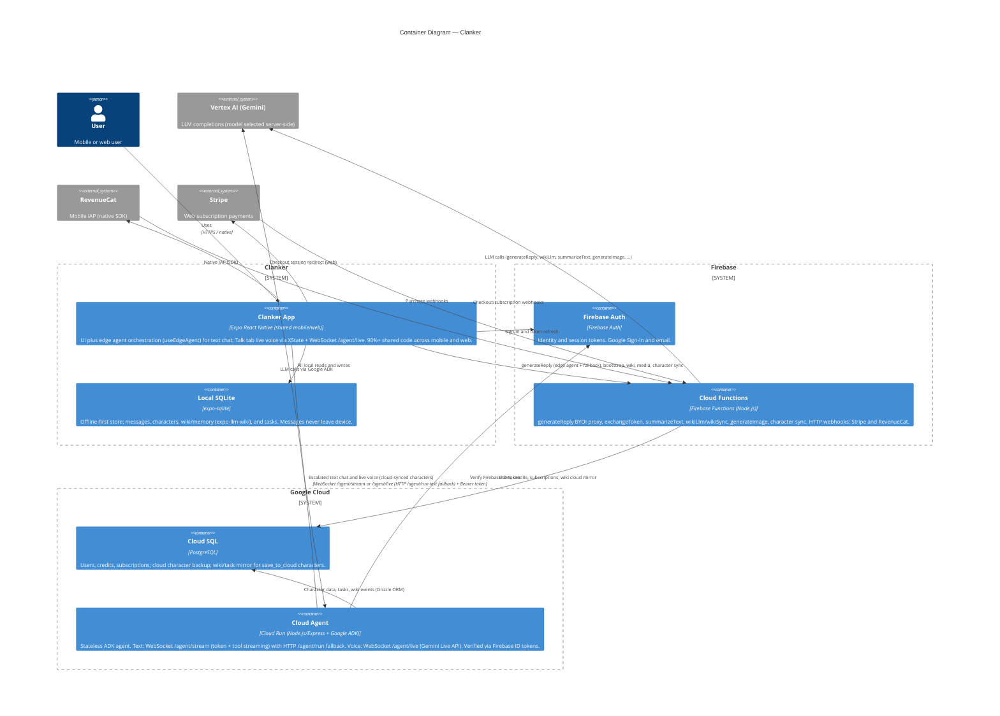

# Containers — Clanker

_Manually maintained. Update when a new container is added or a relationship changes._

## Text chat routing (summary)

Priority order in `useAIChat` after send:

1. **Edge resolved** — `useEdgeAgent` loop returns text; each iteration billed via `generateReply`.
2. **Cloud Agent** — `callCloudAgent` tries WebSocket `/agent/stream` first (streaming tokens and tool events); falls back to HTTP `POST /agent/run` on connection or auth failure. Used when character is cloud-synced (or dev sandbox) and `EXPO_PUBLIC_CLOUD_AGENT_URL` is set.
3. **Firebase fallback** — `sendMessageWithAIResponse` → `generateReply` with optional unsynced history.

## Voice routing (Talk tab)

`useLiveVoiceChat` on the Talk tab (native only for mic streaming):

1. **Pre-call wiki sync** — `wikiSync` callable via `liveVoiceMachine` before WebSocket connect.
2. **Live session** — WebSocket `/agent/live`: 16 kHz mic uplink, 24 kHz PCM downlink, transcript tokens, tool events, credit snapshots. Requires `save_to_cloud`, voice, and credits.
3. **Teardown** — transcript persisted to SQLite; session ends on hang-up, navigation blur, or app background.

> **Note:** The `/agent/live` Cloud Agent handler is deployed separately from the client.

See [Edge Agent](../../edge-agent.md) and [AI & Chat](../../ai-and-chat.md).
