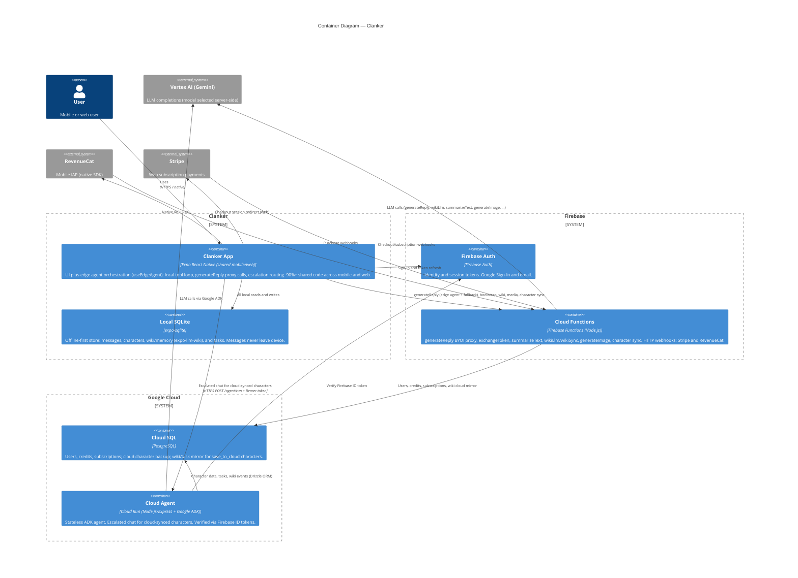

# Containers — Clanker

_Manually maintained. Update when a new container is added or a relationship changes._

## Chat routing (summary)

Priority order in `useAIChat` after send:

1. **Edge resolved** — `useEdgeAgent` loop returns text; each iteration billed via `generateReply`.
2. **Cloud Agent** — `callCloudAgent` when character is cloud-synced (or dev sandbox) and `EXPO_PUBLIC_CLOUD_AGENT_URL` is set.
3. **Firebase fallback** — `sendMessageWithAIResponse` → `generateReply` with optional unsynced history.

See [Edge Agent](../../EDGE_AGENT.md) and [AI & Chat](../../ai-and-chat.md).
