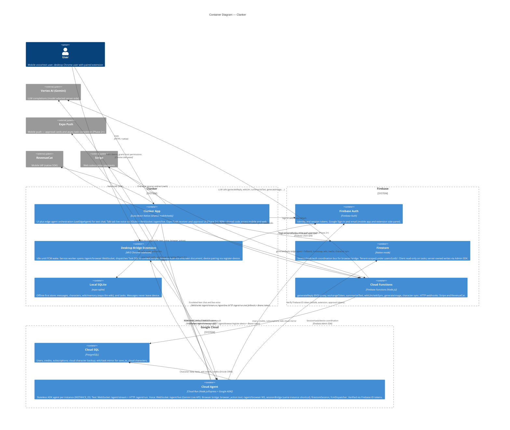

# Containers — Clanker

_Manually maintained. Update when a new container is added or a relationship changes._

## Text chat routing (summary)

Priority order in `useAIChat` after send:

1. **Edge resolved** — `useEdgeAgent` loop returns text; each iteration billed via `generateReply`.
2. **Cloud Agent** — `callCloudAgent` tries WebSocket `/agent/stream` first (streaming tokens and tool events); falls back to HTTP `POST /agent/run` on connection or auth failure. Used when character is cloud-synced (or dev sandbox) and `EXPO_PUBLIC_CLOUD_AGENT_URL` is set.
3. **Firebase fallback** — `sendMessageWithAIResponse` → `generateReply` with optional unsynced history.

## Voice routing (Talk tab)

`useLiveVoiceChat` on the Talk tab (native only for mic streaming):

1. **Pre-call wiki sync** — `wikiSync` callable via `liveVoiceMachine` before WebSocket connect.
2. **Live session** — WebSocket `/agent/live`: 16 kHz mic uplink, 24 kHz PCM downlink, transcript tokens, tool events, credit snapshots. Requires `save_to_cloud`, voice, and credits.
3. **Teardown** — transcript persisted to SQLite; session ends on hang-up, navigation blur, or app background.

## Browser bridge routing (Desktop Bridge extension)

Three-node async loop. Voice WS and browser WS may land on different Cloud Run instances; Firestore is the sole cross-instance routing bus.

| Node | Container | Connection |
|------|-----------|------------|
| Mobile | Clanker App | `/agent/live` or `/agent/run` (triggers `browser_action`) |
| Coordinator | Cloud Agent | In-memory `sessionBridge` per instance; Firestore writes + FCM dispatch |
| Desktop | Desktop Bridge Extension | Idle (FCM) → active (`/agent/browser` WS on wake) |

**Happy path:**

1. **Trigger** — `browser_action` ADK tool (`cloud-agent/src/tools/browserAction.ts`) creates `sessionId` + `taskId`, writes session/task docs to Firestore, calls `fcmDispatcher.wakeExtension`.
2. **Wake** — Extension service worker receives FCM `WAKE_AND_CONNECT`, mints ID token via offscreen auth, connects `/agent/browser` with auth frame.
3. **Execute** — Browser-side handler calls `markBrowserConnected`, sends `session_ready`, dispatches Task DSL to content scripts via `chrome.scripting.executeScript`.
4. **Result** — Extension returns `task_result` via WS; Cloud Agent writes to Firestore; voice-side `watchTask` listener delivers to Gemini Live (or text path `await`s with 30s cap).
5. **Teardown** — `session_end` frame; extension closes WS and offscreen auth doc; service worker suspends.

**Phase 2+ approval path:** Extension halts on destructive action → auth doc in Firestore → Expo Push approval card → mobile writes approval → FCM re-wake with `resume: true`.

> **Note:** `sessionBridge.voiceWs` / `browserWs` are same-instance shortcuts only. Primary result delivery is always the Firestore `watchTask` listener on the voice-side instance.

See [Edge Agent](../../edge-agent.md), [AI & Chat](../../ai-and-chat.md), and the [MV3 Browser Extension Bridge design spec](../../superpowers/specs/2026-06-29-mv3-browser-extension-bridge-design.md).
