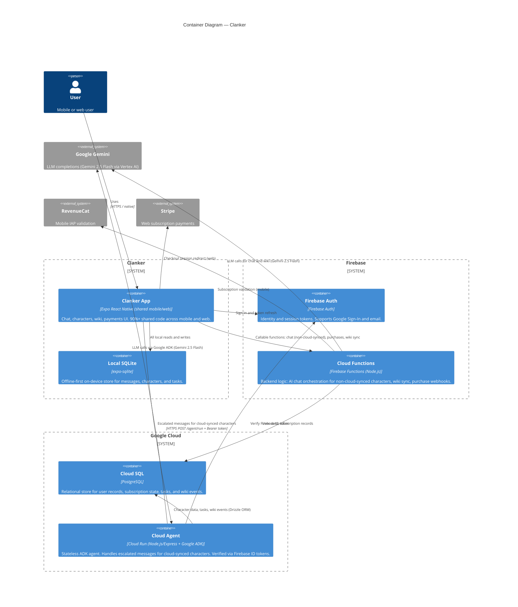

# Containers — Clanker

_Manually maintained. Update when a new container is added or a relationship changes._

```mermaid
C4Container
  title Container Diagram — Clanker

  Person(user, "User", "Mobile or web user")

  System_Boundary(clanker_b, "Clanker") {
    Container(app, "Clanker App", "Expo React Native (shared mobile/web)", "Chat, characters, wiki, payments UI. 90%+ shared code across mobile and web.")
    Container(sqlite, "Local SQLite", "expo-sqlite", "Offline-first on-device store for messages, characters, and tasks.")
  }

  System_Boundary(firebase_b, "Firebase") {
    Container(auth, "Firebase Auth", "Firebase Auth", "Identity and session tokens. Supports Google Sign-In and email.")
    Container(functions, "Cloud Functions", "Firebase Functions (Node.js)", "Backend logic: AI chat orchestration for non-cloud-synced characters, wiki sync, purchase webhooks.")
  }

  System_Boundary(gcp_b, "Google Cloud") {
    Container(cloudsql, "Cloud SQL", "PostgreSQL", "Relational store for user records, subscription state, tasks, and wiki events.")
    Container(cloudagent, "Cloud Agent", "Cloud Run (Node.js/Express + Google ADK)", "Stateless ADK agent. Handles escalated messages for cloud-synced characters. Verified via Firebase ID tokens.")
  }

  System_Ext(gemini, "Google Gemini", "LLM completions (Gemini 2.5 Flash via Vertex AI)")
  System_Ext(revenuecat, "RevenueCat", "Mobile IAP validation")
  System_Ext(stripe, "Stripe", "Web subscription payments")

  Rel(user, app, "Uses", "HTTPS / native")
  Rel(app, auth, "Sign-in and token refresh")
  Rel(app, functions, "Callable functions: chat (non-cloud-synced), purchases, wiki sync")
  Rel(app, cloudagent, "Escalated messages for cloud-synced characters", "HTTPS POST /agent/run + Bearer token")
  Rel(app, sqlite, "All local reads and writes")
  Rel(app, stripe, "Checkout session redirect (web)")
  Rel(functions, cloudsql, "User data, subscription records")
  Rel(functions, gemini, "LLM calls for chat and wiki (Gemini 2.5 Flash)")
  Rel(functions, revenuecat, "Subscription validation (mobile)")
  Rel(cloudagent, auth, "Verify Firebase ID token")
  Rel(cloudagent, cloudsql, "Character data, tasks, wiki events (Drizzle ORM)")
  Rel(cloudagent, gemini, "LLM calls via Google ADK (Gemini 2.5 Flash)")
```