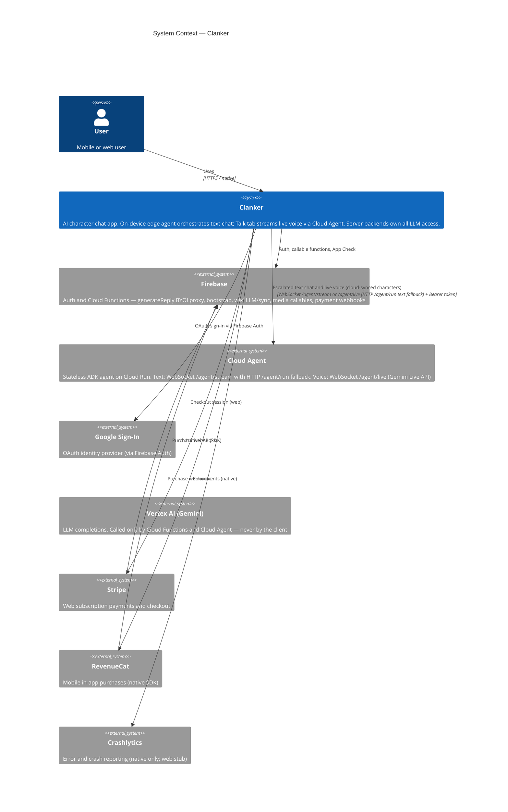

# System Context — Clanker

_Manually maintained. Update when external system integrations change._

## Text chat routing (summary)

The client never calls Gemini directly. After the user sends a message:

1. **Edge agent** (in-app) — multi-turn tool loop; each iteration calls `generateReply` (Firebase callable BYOI proxy). Local wiki/tasks run against SQLite.
2. **Cloud Agent** — WebSocket `/agent/stream` first (streaming tokens and tool events), HTTP `/agent/run` fallback on connection or auth failure. Cloud-synced character with `cloud_id` when `EXPO_PUBLIC_CLOUD_AGENT_URL` is set.
3. **Firebase fallback** — `sendMessageWithAIResponse`, which also calls `generateReply` (with optional unsynced history batch).

## Voice routing (Talk tab)

Live voice uses a separate path from text chat:

1. **Pre-call wiki sync** — `wikiSync` callable merges local wiki with cloud before the session opens.
2. **Cloud Agent live session** — WebSocket `/agent/live` (Gemini Live API): bidirectional base64 PCM audio, transcript tokens, tool events, and credit usage snapshots. Requires `save_to_cloud`, voice configured, and sufficient credits.
3. **Local persistence** — transcript saved to SQLite on end call; audio I/O is on-device only (`expo-audio`, `react-native-live-audio-stream`).

> **Note:** The `/agent/live` Cloud Agent handler is deployed separately from the client.

See [Edge Agent](../../edge-agent.md) and [AI & Chat](../../ai-and-chat.md).
