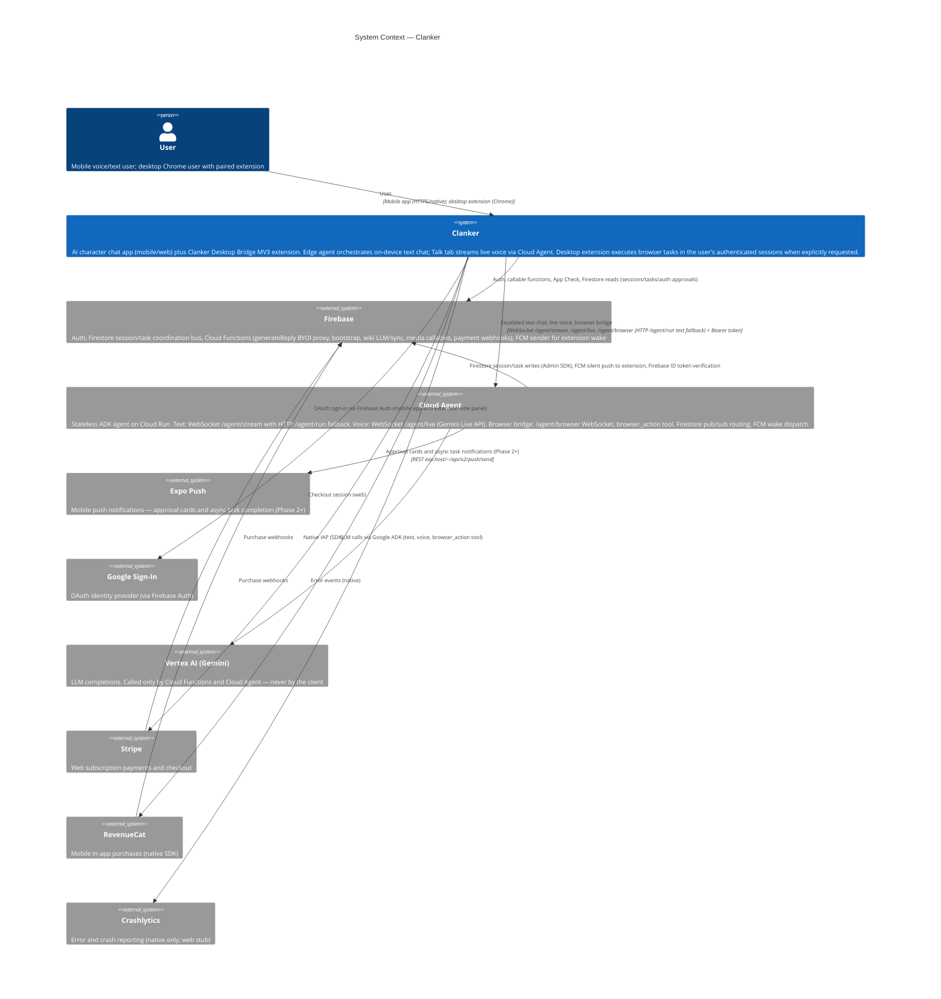

# System Context — Clanker

_Manually maintained. Update when external system integrations change._

## Text chat routing (summary)

The client never calls Gemini directly. After the user sends a message:

1. **Edge agent** (in-app) — multi-turn tool loop; each iteration calls `generateReply` (Firebase callable BYOI proxy). Local wiki/tasks run against SQLite.
2. **Cloud Agent** — WebSocket `/agent/stream` first (streaming tokens and tool events), HTTP `/agent/run` fallback on connection or auth failure. Cloud-synced character with `cloud_id` when `EXPO_PUBLIC_CLOUD_AGENT_URL` is set.
3. **Firebase fallback** — `sendMessageWithAIResponse`, which also calls `generateReply` (with optional unsynced history batch).

## Voice routing (Talk tab)

Live voice uses a separate path from text chat:

1. **Pre-call wiki sync** — `wikiSync` callable merges local wiki with cloud before the session opens.
2. **Cloud Agent live session** — WebSocket `/agent/live` (Gemini Live API): bidirectional base64 PCM audio, transcript tokens, tool events, and credit usage snapshots. Requires `save_to_cloud`, voice configured, and sufficient credits.
3. **Local persistence** — transcript saved to SQLite on end call; audio I/O is on-device only (`expo-audio`, `react-native-live-audio-stream`).

## Browser bridge routing (Desktop Bridge extension)

Cross-device browser tasks use a three-node async loop. Cloud Run instances never communicate directly — all cross-node routing flows through Firestore.

1. **Trigger** — Gemini invokes `browser_action` on `/agent/live` (voice) or `/agent/run` (text). Cloud Agent creates session + task docs in Firestore, resolves paired device, and dispatches FCM `WAKE_AND_CONNECT`.
2. **Wake-and-Connect** — MV3 service worker wakes on FCM, mints Firebase ID token via offscreen auth bridge, opens WebSocket `/agent/browser`, and executes the Task DSL in the user's browser.
3. **Result delivery** — Extension returns results via WS → Cloud Agent writes to Firestore → voice-side `watchTask` listener pushes into Gemini Live (or text path awaits synchronously). If the voice session is closed, Expo Push delivers async completion (Phase 2+).
4. **Approval (Phase 2+)** — Destructive actions halt execution; mobile user taps Approve/Deny on an Expo Push card; approval token written to Firestore resumes the extension.

> **Note:** Cloud Agent `/agent/live` and `/agent/browser` handlers are deployed on Cloud Run. Firestore replaces in-memory cross-instance routing for browser task coordination.

See [Edge Agent](../../edge-agent.md), [AI & Chat](../../ai-and-chat.md), and the [MV3 Browser Extension Bridge design spec](../../superpowers/specs/2026-06-29-mv3-browser-extension-bridge-design.md).
