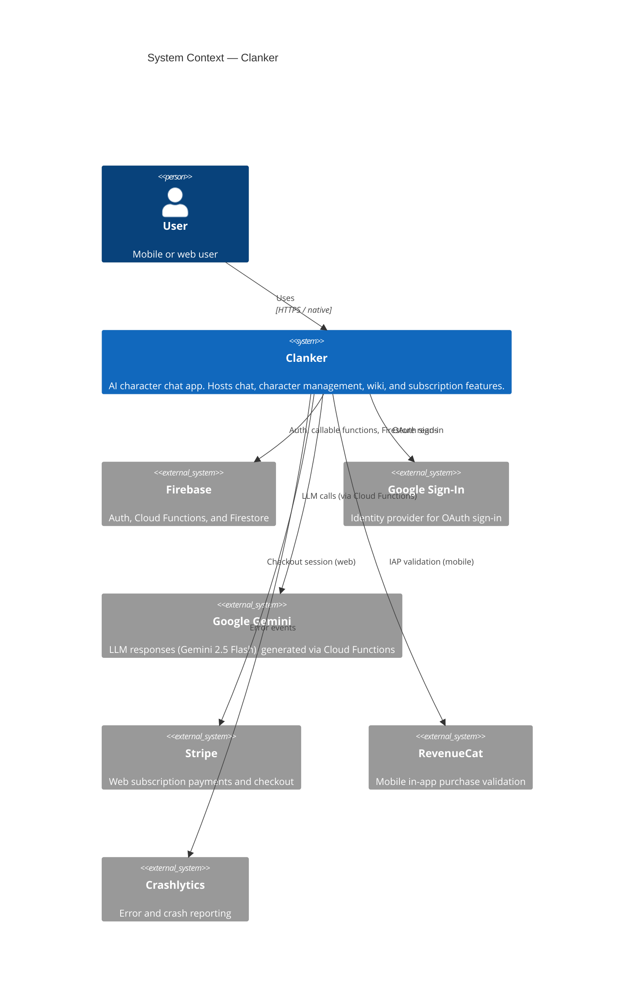

# System Context — Clanker

_Manually maintained. Update when external system integrations change._

```mermaid
C4Context
  title System Context — Clanker

  Person(user, "User", "Mobile or web user")

  System(clanker, "Clanker", "AI character chat app. Hosts chat, character management, wiki, and subscription features.")

  System_Ext(firebase, "Firebase", "Auth, Cloud Functions, and Firestore")
  System_Ext(google, "Google Sign-In", "Identity provider for OAuth sign-in")
  System_Ext(gemini, "Google Gemini", "LLM responses (Gemini 2.5 Flash), generated via Cloud Functions")
  System_Ext(stripe, "Stripe", "Web subscription payments and checkout")
  System_Ext(revenuecat, "RevenueCat", "Mobile in-app purchase validation")
  System_Ext(crashlytics, "Crashlytics", "Error and crash reporting")

  Rel(user, clanker, "Uses", "HTTPS / native")
  Rel(clanker, firebase, "Auth, callable functions, Firestore reads")
  Rel(clanker, google, "OAuth sign-in")
  Rel(clanker, gemini, "LLM calls (via Cloud Functions)")
  Rel(clanker, stripe, "Checkout session (web)")
  Rel(clanker, revenuecat, "IAP validation (mobile)")
  Rel(clanker, crashlytics, "Error events")
```