# components call graph + import fallback

_Auto-generated. Run `npm run docs:charts` to regenerate._

```mermaid
graph LR
  ChatComposer__src_components_ChatComposer_tsx["ChatComposer
(ChatComposer.tsx)"] --> useCharacterWiki__src_hooks_useCharacterWiki_ts["useCharacterWiki
(useCharacterWiki.ts)"]
  ChatComposer__src_components_ChatComposer_web_tsx["ChatComposer
(ChatComposer.web.tsx)"] --> useCharacterWiki__src_hooks_useCharacterWiki_ts["useCharacterWiki
(useCharacterWiki.ts)"]
  ChatView__src_components_ChatView_tsx["ChatView
(ChatView.tsx)"] --> useAuthMachine__src_hooks_useMachines_ts["useAuthMachine
(useMachines.ts)"]
  ChatView__src_components_ChatView_tsx["ChatView
(ChatView.tsx)"] --> useCharacter__src_hooks_useCharacters_ts["useCharacter
(useCharacters.ts)"]
  ChatView__src_components_ChatView_tsx["ChatView
(ChatView.tsx)"] --> useChatMessages__src_hooks_useMessages_ts["useChatMessages
(useMessages.ts)"]
  ChatView__src_components_ChatView_tsx["ChatView
(ChatView.tsx)"] --> useUserCredits__src_hooks_useUserCredits_ts["useUserCredits
(useUserCredits.ts)"]
  ChatView__src_components_ChatView_tsx["ChatView
(ChatView.tsx)"] --> useCharacterWiki__src_hooks_useCharacterWiki_ts["useCharacterWiki
(useCharacterWiki.ts)"]
  ChatView__src_components_ChatView_tsx["ChatView
(ChatView.tsx)"] --> useAIChat__src_hooks_useAIChat_ts["useAIChat
(useAIChat.ts)"]
  CombinedSubscriptionButton__src_components_CombinedSubscriptionButton_tsx["CombinedSubscriptionButton
(CombinedSubscriptionButton.tsx)"] --> useCurrentPlan__src_hooks_useCurrentPlan_ts["useCurrentPlan
(useCurrentPlan.ts)"]
  CookieConsentBanner__src_components_CookieConsent_CookieConsentBanner_tsx["CookieConsentBanner
(CookieConsentBanner.tsx)"] --> useCookieConsent__src_components_CookieConsent_CookieConsentContext_tsx["useCookieConsent
(CookieConsentContext.tsx)"]
  CookieConsentProvider__src_components_CookieConsent_CookieConsentContext_tsx["CookieConsentProvider
(CookieConsentContext.tsx)"] --> readConsent__src_utilities_cookieConsentStorage_web_ts["readConsent
(cookieConsentStorage.web.ts)"]
  CookieConsentProvider__src_components_CookieConsent_CookieConsentContext_tsx["CookieConsentProvider
(CookieConsentContext.tsx)"] --> buildRecord__src_components_CookieConsent_CookieConsentContext_tsx["buildRecord
(CookieConsentContext.tsx)"]
  CookieConsentProvider__src_components_CookieConsent_CookieConsentContext_tsx["CookieConsentProvider
(CookieConsentContext.tsx)"] --> writeConsent__src_utilities_cookieConsentStorage_web_ts["writeConsent
(cookieConsentStorage.web.ts)"]
  CookieConsentProvider__src_components_CookieConsent_CookieConsentContext_tsx["CookieConsentProvider
(CookieConsentContext.tsx)"] --> setCrashlyticsEnabled__src_services_crashlyticsService_ts["setCrashlyticsEnabled
(crashlyticsService.ts)"]
  CookieConsentProvider__src_components_CookieConsent_CookieConsentContext_tsx["CookieConsentProvider
(CookieConsentContext.tsx)"] --> defaultAcceptChoices__src_utilities_cookieConsentTypes_ts["defaultAcceptChoices
(cookieConsentTypes.ts)"]
  CookieConsentProvider__src_components_CookieConsent_CookieConsentContext_tsx["CookieConsentProvider
(CookieConsentContext.tsx)"] --> defaultRejectChoices__src_utilities_cookieConsentTypes_ts["defaultRejectChoices
(cookieConsentTypes.ts)"]
  CookiePreferencesModal__src_components_CookieConsent_CookiePreferencesModal_tsx["CookiePreferencesModal
(CookiePreferencesModal.tsx)"] --> useCookieConsent__src_components_CookieConsent_CookieConsentContext_tsx["useCookieConsent
(CookieConsentContext.tsx)"]
  CookiePreferencesModal__src_components_CookieConsent_CookiePreferencesModal_tsx["CookiePreferencesModal
(CookiePreferencesModal.tsx)"] --> COOKIE_CATEGORIES__src_utilities_cookieConsentTypes_ts["COOKIE_CATEGORIES
(cookieConsentTypes.ts)"]
  CreditCounterIcon__src_components_CreditCounterIcon_tsx["CreditCounterIcon
(CreditCounterIcon.tsx)"] --> useCurrentPlan__src_hooks_useCurrentPlan_ts["useCurrentPlan
(useCurrentPlan.ts)"]
  CreditCounterIcon__src_components_CreditCounterIcon_tsx["CreditCounterIcon
(CreditCounterIcon.tsx)"] --> useUserCredits__src_hooks_useUserCredits_ts["useUserCredits
(useUserCredits.ts)"]
  CreditsDisplay__src_components_CreditsDisplay_tsx["CreditsDisplay
(CreditsDisplay.tsx)"] --> useUserCredits__src_hooks_useUserCredits_ts["useUserCredits
(useUserCredits.ts)"]
  CreditsDisplay__src_components_CreditsDisplay_tsx["CreditsDisplay
(CreditsDisplay.tsx)"] --> useBootstrapRefresh__src_hooks_useBootstrapRefresh_ts["useBootstrapRefresh
(useBootstrapRefresh.ts)"]
  CreditsDisplay__src_components_CreditsDisplay_tsx["CreditsDisplay
(CreditsDisplay.tsx)"] --> makePackagePurchase__src_utilities_makePackagePurchase_ts["makePackagePurchase
(makePackagePurchase.ts)"]
  ComingSoonCard__src_components_LandingPage_ComingSoonSection_tsx["ComingSoonCard
(ComingSoonSection.tsx)"] --> useFloatingCardAnimation__src_hooks_useFloatingCardAnimation_ts["useFloatingCardAnimation
(useFloatingCardAnimation.ts)"]
  FeatureCard__src_components_LandingPage_FeaturesSection_tsx["FeatureCard
(FeaturesSection.tsx)"] --> useFloatingCardAnimation__src_hooks_useFloatingCardAnimation_ts["useFloatingCardAnimation
(useFloatingCardAnimation.ts)"]
  HeroSection__src_components_LandingPage_HeroSection_tsx["HeroSection
(HeroSection.tsx)"] --> useAuthMachine__src_hooks_useMachines_ts["useAuthMachine
(useMachines.ts)"]
  LandingFooter__src_components_LandingPage_LandingFooter_tsx["LandingFooter
(LandingFooter.tsx)"] --> useCookieConsent__src_components_CookieConsent_CookieConsentContext_tsx["useCookieConsent
(CookieConsentContext.tsx)"]
  SubscribeButton__src_components_SubscribeButton_tsx["SubscribeButton
(SubscribeButton.tsx)"] --> useBootstrapRefresh__src_hooks_useBootstrapRefresh_ts["useBootstrapRefresh
(useBootstrapRefresh.ts)"]
  SubscribeButton__src_components_SubscribeButton_tsx["SubscribeButton
(SubscribeButton.tsx)"] --> makePackagePurchase__src_utilities_makePackagePurchase_ts["makePackagePurchase
(makePackagePurchase.ts)"]
  SubscribeButton__src_components_SubscribeButton_tsx["SubscribeButton
(SubscribeButton.tsx)"] --> getPurchaseFailureAlertMessage__src_components_SubscribeButton_tsx["getPurchaseFailureAlertMessage
(SubscribeButton.tsx)"]
  ThemeProvider__src_components_ThemeProvider_tsx["ThemeProvider
(ThemeProvider.tsx)"] --> useSettings__src_contexts_SettingsContext_tsx["useSettings
(SettingsContext.tsx)"]
  AdminConfirmationModal__src_components_admin_ConfirmationModal_tsx["AdminConfirmationModal
(ConfirmationModal.tsx)"] --> canSubmitAdminConfirmation__src_components_admin_confirmationValidation_ts["canSubmitAdminConfirmation
(confirmationValidation.ts)"]
  UserActionPanel__src_components_admin_UserActionPanel_tsx["UserActionPanel
(UserActionPanel.tsx)"] --> asWritablePlanTier__src_components_admin_UserActionPanel_tsx["asWritablePlanTier
(UserActionPanel.tsx)"]
  UserActionPanel__src_components_admin_UserActionPanel_tsx["UserActionPanel
(UserActionPanel.tsx)"] --> asWritablePlanStatus__src_components_admin_UserActionPanel_tsx["asWritablePlanStatus
(UserActionPanel.tsx)"]
  UserActionPanel__src_components_admin_UserActionPanel_tsx["UserActionPanel
(UserActionPanel.tsx)"] --> normalizeRenewalDateInput__src_components_admin_renewalDateValidation_ts["normalizeRenewalDateInput
(renewalDateValidation.ts)"]
  useCharacterWiki__src_hooks_useCharacterWiki_ts["useCharacterWiki
(useCharacterWiki.ts)"] --> wikiOrchestrator__src_services_wikiOrchestrator_ts["wikiOrchestrator
(wikiOrchestrator.ts)"]
  useCharacterWiki__src_hooks_useCharacterWiki_ts["useCharacterWiki
(useCharacterWiki.ts)"] --> tailForEntity__src_hooks_useCharacterWiki_ts["tailForEntity
(useCharacterWiki.ts)"]
  useCharacterWiki__src_hooks_useCharacterWiki_ts["useCharacterWiki
(useCharacterWiki.ts)"] --> waitForActorOperation__src_hooks_useCharacterWiki_ts["waitForActorOperation
(useCharacterWiki.ts)"]
  useCharacterWiki__src_hooks_useCharacterWiki_ts["useCharacterWiki
(useCharacterWiki.ts)"] --> wikiSync__src_services_apiClient_ts["wikiSync
(apiClient.ts)"]
  useCharacterWiki__src_hooks_useCharacterWiki_ts["useCharacterWiki
(useCharacterWiki.ts)"] --> reportError__src_utilities_reportError_ts["reportError
(reportError.ts)"]
  useCharacter__src_hooks_useCharacters_ts["useCharacter
(useCharacters.ts)"] --> useCharacterMachine__src_hooks_useMachines_ts["useCharacterMachine
(useMachines.ts)"]
  useChatMessages__src_hooks_useMessages_ts["useChatMessages
(useMessages.ts)"] --> useMessages__src_hooks_useMessages_ts["useMessages
(useMessages.ts)"]
  useUserCredits__src_hooks_useUserCredits_ts["useUserCredits
(useUserCredits.ts)"] --> useAuthMachine__src_hooks_useMachines_ts["useAuthMachine
(useMachines.ts)"]
  useUserCredits__src_hooks_useUserCredits_ts["useUserCredits
(useUserCredits.ts)"] --> useAuthCredits__src_hooks_useAuthSnapshot_ts["useAuthCredits
(useAuthSnapshot.ts)"]
  useUserCredits__src_hooks_useUserCredits_ts["useUserCredits
(useUserCredits.ts)"] --> requestBootstrapRefresh__src_hooks_useBootstrapRefresh_ts["requestBootstrapRefresh
(useBootstrapRefresh.ts)"]
  useAIChat__src_hooks_useAIChat_ts["useAIChat
(useAIChat.ts)"] --> useChatMessages__src_hooks_useMessages_ts["useChatMessages
(useMessages.ts)"]
  useAIChat__src_hooks_useAIChat_ts["useAIChat
(useAIChat.ts)"] --> useAuthMachine__src_hooks_useMachines_ts["useAuthMachine
(useMachines.ts)"]
  useAIChat__src_hooks_useAIChat_ts["useAIChat
(useAIChat.ts)"] --> useCharacterWiki__src_hooks_useCharacterWiki_ts["useCharacterWiki
(useCharacterWiki.ts)"]
  useAIChat__src_hooks_useAIChat_ts["useAIChat
(useAIChat.ts)"] --> useEdgeAgent__src_hooks_useEdgeAgent_ts["useEdgeAgent
(useEdgeAgent.ts)"]
  useAIChat__src_hooks_useAIChat_ts["useAIChat
(useAIChat.ts)"] --> reportError__src_utilities_reportError_ts["reportError
(reportError.ts)"]
  useAIChat__src_hooks_useAIChat_ts["useAIChat
(useAIChat.ts)"] --> saveAIMessage__src_database_messageDatabase_ts["saveAIMessage
(messageDatabase.ts)"]
  useAIChat__src_hooks_useAIChat_ts["useAIChat
(useAIChat.ts)"] --> triggerConversationSummary__src_services_aiChatService_ts["triggerConversationSummary
(aiChatService.ts)"]
  useAIChat__src_hooks_useAIChat_ts["useAIChat
(useAIChat.ts)"] --> getRecentConversationHistory__src_services_aiChatService_ts["getRecentConversationHistory
(aiChatService.ts)"]
  useAIChat__src_hooks_useAIChat_ts["useAIChat
(useAIChat.ts)"] --> getUnsyncedMessages__src_database_messageDatabase_ts["getUnsyncedMessages
(messageDatabase.ts)"]
  useAIChat__src_hooks_useAIChat_ts["useAIChat
(useAIChat.ts)"] --> toSyncMessage__src_services_syncMessage_ts["toSyncMessage
(syncMessage.ts)"]
  useAIChat__src_hooks_useAIChat_ts["useAIChat
(useAIChat.ts)"] --> sendMessageWithAIResponse__src_services_aiChatService_ts["sendMessageWithAIResponse
(aiChatService.ts)"]
  useAIChat__src_hooks_useAIChat_ts["useAIChat
(useAIChat.ts)"] --> markMessagesAsSynced__src_database_messageDatabase_ts["markMessagesAsSynced
(messageDatabase.ts)"]
  useAIChat__src_hooks_useAIChat_ts["useAIChat
(useAIChat.ts)"] --> messageKeys__src_hooks_useMessages_ts["messageKeys
(useMessages.ts)"]
  useAIChat__src_hooks_useAIChat_ts["useAIChat
(useAIChat.ts)"] --> usageSnapshotFromError__src_services_usageSnapshot_ts["usageSnapshotFromError
(usageSnapshot.ts)"]
  useCurrentPlan__src_hooks_useCurrentPlan_ts["useCurrentPlan
(useCurrentPlan.ts)"] --> useAuthMachine__src_hooks_useMachines_ts["useAuthMachine
(useMachines.ts)"]
  useCurrentPlan__src_hooks_useCurrentPlan_ts["useCurrentPlan
(useCurrentPlan.ts)"] --> isPlanTier__src_hooks_useCurrentPlan_ts["isPlanTier
(useCurrentPlan.ts)"]
  readConsent__src_utilities_cookieConsentStorage_web_ts["readConsent
(cookieConsentStorage.web.ts)"] --> getStorage__src_utilities_cookieConsentStorage_web_ts["getStorage
(cookieConsentStorage.web.ts)"]
  readConsent__src_utilities_cookieConsentStorage_web_ts["readConsent
(cookieConsentStorage.web.ts)"] --> isRecord__src_utilities_cookieConsentStorage_web_ts["isRecord
(cookieConsentStorage.web.ts)"]
  writeConsent__src_utilities_cookieConsentStorage_web_ts["writeConsent
(cookieConsentStorage.web.ts)"] --> getStorage__src_utilities_cookieConsentStorage_web_ts["getStorage
(cookieConsentStorage.web.ts)"]
  useBootstrapRefresh__src_hooks_useBootstrapRefresh_ts["useBootstrapRefresh
(useBootstrapRefresh.ts)"] --> useAuthMachine__src_hooks_useMachines_ts["useAuthMachine
(useMachines.ts)"]
  useBootstrapRefresh__src_hooks_useBootstrapRefresh_ts["useBootstrapRefresh
(useBootstrapRefresh.ts)"] --> requestBootstrapRefresh__src_hooks_useBootstrapRefresh_ts["requestBootstrapRefresh
(useBootstrapRefresh.ts)"]
  makePackagePurchase__src_utilities_makePackagePurchase_ts["makePackagePurchase
(makePackagePurchase.ts)"] --> purchaseProduct__src_config_revenueCatConfig_ts["purchaseProduct
(revenueCatConfig.ts)"]
  makePackagePurchase__src_utilities_makePackagePurchase_ts["makePackagePurchase
(makePackagePurchase.ts)"] --> purchasePackageStripe__src_config_firebaseConfig_ts["purchasePackageStripe
(firebaseConfig.ts)"]
  makePackagePurchase__src_utilities_makePackagePurchase_ts["makePackagePurchase
(makePackagePurchase.ts)"] --> getCurrentUser__src_auth_googleSignin_ts["getCurrentUser
(googleSignin.ts)"]
  makePackagePurchase__src_utilities_makePackagePurchase_ts["makePackagePurchase
(makePackagePurchase.ts)"] --> getCheckoutSourceTabId__src_utilities_makePackagePurchase_ts["getCheckoutSourceTabId
(makePackagePurchase.ts)"]
  makePackagePurchase__src_utilities_makePackagePurchase_ts["makePackagePurchase
(makePackagePurchase.ts)"] --> upsertCheckoutAttempt__src_utilities_checkoutStateStore_ts["upsertCheckoutAttempt
(checkoutStateStore.ts)"]
  makePackagePurchase__src_utilities_makePackagePurchase_ts["makePackagePurchase
(makePackagePurchase.ts)"] --> createCheckoutChannel__src_utilities_checkoutChannel_ts["createCheckoutChannel
(checkoutChannel.ts)"]
  AcceptTerms__src_components_AcceptTerms_tsx["AcceptTerms
(AcceptTerms.tsx)"] --> __components_Button["Button
(components)"]
  AcceptTerms__src_components_AcceptTerms_tsx["AcceptTerms
(AcceptTerms.tsx)"] --> __components_Logo["Logo
(components)"]
  AcceptTerms__src_components_AcceptTerms_tsx["AcceptTerms
(AcceptTerms.tsx)"] --> __config_termsConfig["termsConfig
(config)"]
  CharacterAvatar__src_components_CharacterAvatar_tsx["CharacterAvatar
(CharacterAvatar.tsx)"] --> __config_constants["constants
(config)"]
  CharacterCard__src_components_CharacterCard_tsx["CharacterCard
(CharacterCard.tsx)"] --> __components_CharacterAvatar["CharacterAvatar
(components)"]
  SubscriptionInfoButton__src_components_SubscriptionInfoButton_tsx["SubscriptionInfoButton
(SubscriptionInfoButton.tsx)"] --> __components_Button["Button
(components)"]
  SubscriptionInfoButton__src_components_SubscriptionInfoButton_tsx["SubscriptionInfoButton
(SubscriptionInfoButton.tsx)"] --> __config_constants["constants
(config)"]
  UsersTable__src_components_admin_UsersTable_tsx["UsersTable
(UsersTable.tsx)"] --> __types_admin["admin
(types)"]
```

> **Note:** Edges involving Firebase callable functions (created via `httpsCallable()`) are
> not captured here. Because callables are instantiated at module scope and invoked indirectly,
> static analysis cannot trace them as call edges. Affected call sites include
> `generateReplyFn`, `generateVoiceReplyFn`, `summarizeTextFn`, and similar callable wrappers.
