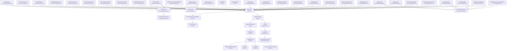

# database call graph

_Auto-generated. Run `npm run docs:charts` to regenerate._

```mermaid
graph TD
  toAppFormat__src_database_characterDatabase_ts["toAppFormat
(characterDatabase.ts)"] --> sanitizeImageMimeType__src_utilities_imageMimeType_ts["sanitizeImageMimeType
(imageMimeType.ts)"]
  getUserCharacters__src_database_characterDatabase_ts["getUserCharacters
(characterDatabase.ts)"] --> getDatabase__src_database_index_ts["getDatabase
(index.ts)"]
  getCharacter__src_database_characterDatabase_ts["getCharacter
(characterDatabase.ts)"] --> getDatabase__src_database_index_ts["getDatabase
(index.ts)"]
  getCharacter__src_database_characterDatabase_ts["getCharacter
(characterDatabase.ts)"] --> toAppFormat__src_database_characterDatabase_ts["toAppFormat
(characterDatabase.ts)"]
  createCharacter__src_database_characterDatabase_ts["createCharacter
(characterDatabase.ts)"] --> getDatabase__src_database_index_ts["getDatabase
(index.ts)"]
  createCharacter__src_database_characterDatabase_ts["createCharacter
(characterDatabase.ts)"] --> normalizeVoice__src_constants_voiceDefaults_ts["normalizeVoice
(voiceDefaults.ts)"]
  createCharacter__src_database_characterDatabase_ts["createCharacter
(characterDatabase.ts)"] --> toAppFormat__src_database_characterDatabase_ts["toAppFormat
(characterDatabase.ts)"]
  updateCharacter__src_database_characterDatabase_ts["updateCharacter
(characterDatabase.ts)"] --> getDatabase__src_database_index_ts["getDatabase
(index.ts)"]
  updateCharacter__src_database_characterDatabase_ts["updateCharacter
(characterDatabase.ts)"] --> normalizeVoice__src_constants_voiceDefaults_ts["normalizeVoice
(voiceDefaults.ts)"]
  updateCharacter__src_database_characterDatabase_ts["updateCharacter
(characterDatabase.ts)"] --> toAppFormat__src_database_characterDatabase_ts["toAppFormat
(characterDatabase.ts)"]
  deleteCharacter__src_database_characterDatabase_ts["deleteCharacter
(characterDatabase.ts)"] --> getDatabase__src_database_index_ts["getDatabase
(index.ts)"]
  hardDeleteCharacterLocal__src_database_characterDatabase_ts["hardDeleteCharacterLocal
(characterDatabase.ts)"] --> getDatabase__src_database_index_ts["getDatabase
(index.ts)"]
  getCharacterCount__src_database_characterDatabase_ts["getCharacterCount
(characterDatabase.ts)"] --> getDatabase__src_database_index_ts["getDatabase
(index.ts)"]
  markCharacterSynced__src_database_characterDatabase_ts["markCharacterSynced
(characterDatabase.ts)"] --> getDatabase__src_database_index_ts["getDatabase
(index.ts)"]
  clearCharacterCloudLink__src_database_characterDatabase_ts["clearCharacterCloudLink
(characterDatabase.ts)"] --> getDatabase__src_database_index_ts["getDatabase
(index.ts)"]
  getUnsyncedCharacters__src_database_characterDatabase_ts["getUnsyncedCharacters
(characterDatabase.ts)"] --> getDatabase__src_database_index_ts["getDatabase
(index.ts)"]
  getSoftDeletedCharacters__src_database_characterDatabase_ts["getSoftDeletedCharacters
(characterDatabase.ts)"] --> getDatabase__src_database_index_ts["getDatabase
(index.ts)"]
  getAllCharactersIncludingDeleted__src_database_characterDatabase_ts["getAllCharactersIncludingDeleted
(characterDatabase.ts)"] --> getDatabase__src_database_index_ts["getDatabase
(index.ts)"]
  searchCharacters__src_database_characterDatabase_ts["searchCharacters
(characterDatabase.ts)"] --> getDatabase__src_database_index_ts["getDatabase
(index.ts)"]
  batchInsertCharacters__src_database_characterDatabase_ts["batchInsertCharacters
(characterDatabase.ts)"] --> getDatabase__src_database_index_ts["getDatabase
(index.ts)"]
  batchInsertCharacters__src_database_characterDatabase_ts["batchInsertCharacters
(characterDatabase.ts)"] --> normalizeVoice__src_constants_voiceDefaults_ts["normalizeVoice
(voiceDefaults.ts)"]
  openDatabaseAsyncWithRetry__src_database_index_ts["openDatabaseAsyncWithRetry
(index.ts)"] --> isOPFSLockError__src_database_index_ts["isOPFSLockError
(index.ts)"]
  getDatabase__src_database_index_ts["getDatabase
(index.ts)"] --> openDatabaseAsyncWithRetry__src_database_index_ts["openDatabaseAsyncWithRetry
(index.ts)"]
  getDatabase__src_database_index_ts["getDatabase
(index.ts)"] --> initializeDatabase__src_database_index_ts["initializeDatabase
(index.ts)"]
  initializeDatabase__src_database_index_ts["initializeDatabase
(index.ts)"] --> applyInitializationPlan__src_database_index_ts["applyInitializationPlan
(index.ts)"]
  initializeDatabase__src_database_index_ts["initializeDatabase
(index.ts)"] --> initWiki__src_services_wikiService_ts["initWiki
(wikiService.ts)"]
  applyInitializationPlan__src_database_index_ts["applyInitializationPlan
(index.ts)"] --> runMigrations__src_database_index_ts["runMigrations
(index.ts)"]
  runMigrations__src_database_index_ts["runMigrations
(index.ts)"] --> applyMigrations__src_database_index_ts["applyMigrations
(index.ts)"]
  applyMigrations__src_database_index_ts["applyMigrations
(index.ts)"] --> isSkipIfTableMissingGuard__src_database_index_ts["isSkipIfTableMissingGuard
(index.ts)"]
  applyMigrations__src_database_index_ts["applyMigrations
(index.ts)"] --> hasTable__src_database_index_ts["hasTable
(index.ts)"]
  applyMigrations__src_database_index_ts["applyMigrations
(index.ts)"] --> hasColumn__src_database_index_ts["hasColumn
(index.ts)"]
  applyMigrations__src_database_index_ts["applyMigrations
(index.ts)"] --> execStatementsSequentially__src_database_index_ts["execStatementsSequentially
(index.ts)"]
  clearAllData__src_database_index_ts["clearAllData
(index.ts)"] --> getDatabase__src_database_index_ts["getDatabase
(index.ts)"]
  getDatabaseStats__src_database_index_ts["getDatabaseStats
(index.ts)"] --> getDatabase__src_database_index_ts["getDatabase
(index.ts)"]
  getMessages__src_database_messageDatabase_ts["getMessages
(messageDatabase.ts)"] --> getDatabase__src_database_index_ts["getDatabase
(index.ts)"]
  getMessages__src_database_messageDatabase_ts["getMessages
(messageDatabase.ts)"] --> toGiftedChatMessage__src_database_messageDatabase_ts["toGiftedChatMessage
(messageDatabase.ts)"]
  getMessage__src_database_messageDatabase_ts["getMessage
(messageDatabase.ts)"] --> getDatabase__src_database_index_ts["getDatabase
(index.ts)"]
  getMessage__src_database_messageDatabase_ts["getMessage
(messageDatabase.ts)"] --> toGiftedChatMessage__src_database_messageDatabase_ts["toGiftedChatMessage
(messageDatabase.ts)"]
  sendMessage__src_database_messageDatabase_ts["sendMessage
(messageDatabase.ts)"] --> getDatabase__src_database_index_ts["getDatabase
(index.ts)"]
  saveAIMessage__src_database_messageDatabase_ts["saveAIMessage
(messageDatabase.ts)"] --> getDatabase__src_database_index_ts["getDatabase
(index.ts)"]
  updateMessageStatus__src_database_messageDatabase_ts["updateMessageStatus
(messageDatabase.ts)"] --> getDatabase__src_database_index_ts["getDatabase
(index.ts)"]
  updateMessageText__src_database_messageDatabase_ts["updateMessageText
(messageDatabase.ts)"] --> getDatabase__src_database_index_ts["getDatabase
(index.ts)"]
  deleteMessage__src_database_messageDatabase_ts["deleteMessage
(messageDatabase.ts)"] --> getDatabase__src_database_index_ts["getDatabase
(index.ts)"]
  deleteCharacterMessages__src_database_messageDatabase_ts["deleteCharacterMessages
(messageDatabase.ts)"] --> getDatabase__src_database_index_ts["getDatabase
(index.ts)"]
  getMessageCount__src_database_messageDatabase_ts["getMessageCount
(messageDatabase.ts)"] --> getDatabase__src_database_index_ts["getDatabase
(index.ts)"]
  getLastMessage__src_database_messageDatabase_ts["getLastMessage
(messageDatabase.ts)"] --> getDatabase__src_database_index_ts["getDatabase
(index.ts)"]
  getLastMessage__src_database_messageDatabase_ts["getLastMessage
(messageDatabase.ts)"] --> toGiftedChatMessage__src_database_messageDatabase_ts["toGiftedChatMessage
(messageDatabase.ts)"]
  searchMessages__src_database_messageDatabase_ts["searchMessages
(messageDatabase.ts)"] --> getDatabase__src_database_index_ts["getDatabase
(index.ts)"]
  searchMessages__src_database_messageDatabase_ts["searchMessages
(messageDatabase.ts)"] --> toGiftedChatMessage__src_database_messageDatabase_ts["toGiftedChatMessage
(messageDatabase.ts)"]
  batchInsertMessages__src_database_messageDatabase_ts["batchInsertMessages
(messageDatabase.ts)"] --> getDatabase__src_database_index_ts["getDatabase
(index.ts)"]
  getMostRecentMessage__src_database_messageDatabase_ts["getMostRecentMessage
(messageDatabase.ts)"] --> getDatabase__src_database_index_ts["getDatabase
(index.ts)"]
  getMostRecentMessage__src_database_messageDatabase_ts["getMostRecentMessage
(messageDatabase.ts)"] --> toGiftedChatMessage__src_database_messageDatabase_ts["toGiftedChatMessage
(messageDatabase.ts)"]
  getMessagesForContextSummary__src_database_messageDatabase_ts["getMessagesForContextSummary
(messageDatabase.ts)"] --> getDatabase__src_database_index_ts["getDatabase
(index.ts)"]
  getMessagesForContextSummary__src_database_messageDatabase_ts["getMessagesForContextSummary
(messageDatabase.ts)"] --> toGiftedChatMessage__src_database_messageDatabase_ts["toGiftedChatMessage
(messageDatabase.ts)"]
  pruneMessagesForCharacter__src_database_messageDatabase_ts["pruneMessagesForCharacter
(messageDatabase.ts)"] --> getDatabase__src_database_index_ts["getDatabase
(index.ts)"]
  initWiki__src_services_wikiService_ts["initWiki
(wikiService.ts)"] --> setupWiki__src_services_wikiService_ts["setupWiki
(wikiService.ts)"]
  setupWiki__src_services_wikiService_ts["setupWiki
(wikiService.ts)"] --> createWikiLlmProvider__src_services_wikiLlmProvider_ts["createWikiLlmProvider
(wikiLlmProvider.ts)"]
```
