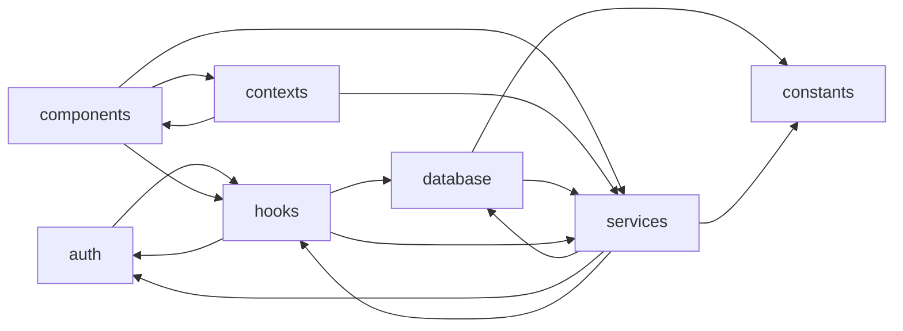

# Source folder dependencies

_Auto-generated. Run `npm run docs:charts` to regenerate._

```mermaid
graph LR
  auth --> hooks
  components --> hooks
  components --> services
  components --> contexts
  contexts --> components
  contexts --> services
  database --> constants
  database --> services
  hooks --> database
  hooks --> services
  hooks --> auth
  services --> database
  services --> auth
  services --> constants
  services --> hooks
```
