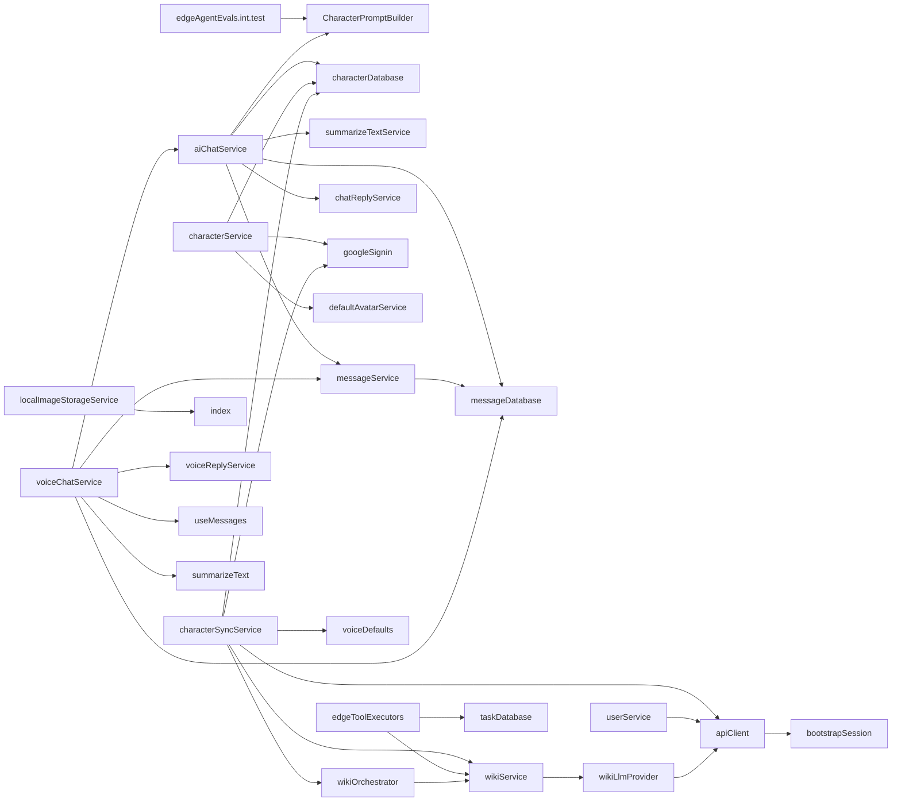

# services file dependencies

_Auto-generated. Run `npm run docs:charts` to regenerate._

```mermaid
graph LR
  edgeAgentEvals.int.test --> CharacterPromptBuilder
  aiChatService --> messageDatabase
  aiChatService --> characterDatabase
  aiChatService --> summarizeTextService
  aiChatService --> messageService
  aiChatService --> CharacterPromptBuilder
  aiChatService --> chatReplyService
  apiClient --> bootstrapSession
  characterService --> googleSignin
  characterService --> characterDatabase
  characterService --> defaultAvatarService
  characterSyncService --> characterDatabase
  characterSyncService --> wikiService
  characterSyncService --> apiClient
  characterSyncService --> wikiOrchestrator
  characterSyncService --> googleSignin
  characterSyncService --> voiceDefaults
  edgeToolExecutors --> wikiService
  edgeToolExecutors --> taskDatabase
  localImageStorageService --> index
  messageService --> messageDatabase
  userService --> apiClient
  voiceChatService --> messageService
  voiceChatService --> voiceReplyService
  voiceChatService --> messageDatabase
  voiceChatService --> aiChatService
  voiceChatService --> useMessages
  voiceChatService --> summarizeText
  wikiLlmProvider --> apiClient
  wikiOrchestrator --> wikiService
  wikiService --> wikiLlmProvider
```
