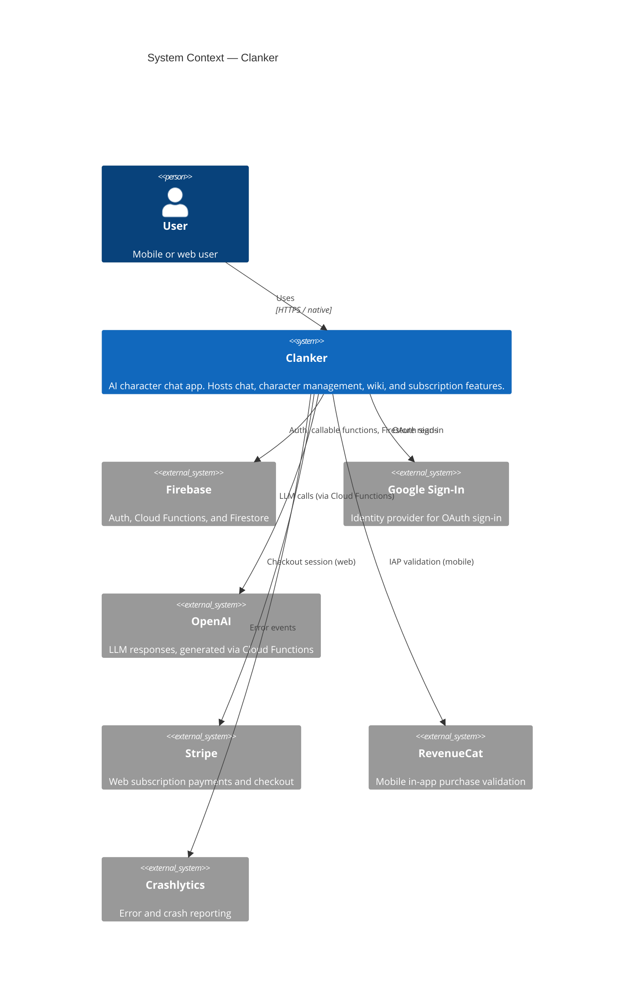
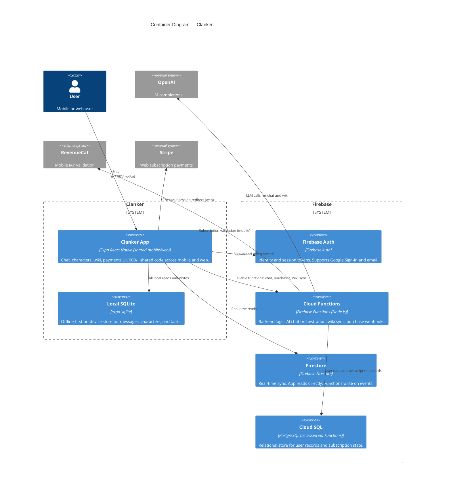

# Flowchart Improvements Implementation Plan

> **For agentic workers:** REQUIRED SUB-SKILL: Use superpowers:subagent-driven-development (recommended) or superpowers:executing-plans to implement this plan task-by-task. Steps use checkbox (`- [ ]`) syntax for tracking.

**Goal:** Replace verbose function-level Mermaid charts with C4 architecture diagrams (manual) and a single folder-level dependency overview (auto-generated).

**Architecture:** Manual C4 charts live in `docs/flowcharts/c4/` as static Mermaid C4Context/C4Container diagrams. The auto-generated script is rewritten to query folder-level edges from CodeGraph and emit one `overview.md` instead of five per-module files. Old per-module files are deleted.

**Tech Stack:** Node.js (CommonJS), better-sqlite3, Mermaid C4 diagram syntax, Jest (test runner: `npx jest`)

---

## File map

| Action | Path | Responsibility |
|---|---|---|
| Modify | `scripts/generate-charts.js` | Rewrite: folder-level query + render, delete old files |
| Modify | `__tests__/generate-charts.test.js` | Replace tests for removed fns, add for new fns |
| Create | `docs/flowcharts/c4/system-context.md` | L1 C4Context diagram (manual) |
| Create | `docs/flowcharts/c4/containers.md` | L2 C4Container diagram (manual) |
| Modify | `docs/flowcharts/README.md` | Point to overview.md and c4/ |
| Delete | `docs/flowcharts/database.md` | Removed — replaced by overview.md |
| Delete | `docs/flowcharts/services.md` | Removed — replaced by overview.md |
| Delete | `docs/flowcharts/hooks.md` | Removed — replaced by overview.md |
| Delete | `docs/flowcharts/machines.md` | Removed — replaced by overview.md |
| Delete | `docs/flowcharts/components.md` | Removed — replaced by overview.md |

---

### Task 1: Replace generate-charts tests with failing tests for new functions

The existing test file tests functions (`sanitizeName`, `makeNodeId`, `buildEdgeSet`, etc.) that will be removed in the rewrite. Replace it entirely with tests for the two new functions: `queryFolderEdges` and `renderFolderOverview`.

**Files:**
- Modify: `__tests__/generate-charts.test.js`

- [ ] **Step 1: Replace the test file**

Overwrite `__tests__/generate-charts.test.js` with:

```javascript
const {
  queryFolderEdges,
  renderFolderOverview,
} = require('../scripts/generate-charts')

describe('queryFolderEdges', () => {
  it('passes the query to db.prepare().all() and returns results', () => {
    const mockRows = [
      { s_dir: 'hooks', t_dir: 'services' },
      { s_dir: 'components', t_dir: 'hooks' },
    ]
    const mockDb = {
      prepare: () => ({ all: () => mockRows }),
    }
    expect(queryFolderEdges(mockDb)).toEqual(mockRows)
  })
})

describe('renderFolderOverview', () => {
  it('renders a graph LR block with folder edges', () => {
    const edges = [
      { s_dir: 'hooks', t_dir: 'services' },
      { s_dir: 'components', t_dir: 'hooks' },
    ]
    const result = renderFolderOverview(edges)
    expect(result).toContain('# Source folder dependencies')
    expect(result).toContain('graph LR')
    expect(result).toContain('  hooks --> services')
    expect(result).toContain('  components --> hooks')
    expect(result).toContain('npm run docs:charts')
  })

  it('returns empty notice when no edges present', () => {
    const result = renderFolderOverview([])
    expect(result).toContain('_No folder-level edges found._')
    expect(result).not.toContain('graph LR')
  })
})
```

- [ ] **Step 2: Run tests — expect FAIL**

```bash
npx jest __tests__/generate-charts.test.js --no-coverage
```

Expected: tests fail with `TypeError: queryFolderEdges is not a function` (or similar — functions don't exist yet).

- [ ] **Step 3: Commit the failing tests**

```bash
git add __tests__/generate-charts.test.js
git commit -m "test(charts): replace tests for new folder-rollup functions"
```

---

### Task 2: Rewrite generate-charts.js

Replace the entire script with the folder-level implementation. The new script exports two pure functions (`queryFolderEdges`, `renderFolderOverview`) and a `main()` that writes `overview.md` and deletes the five old per-module files.

**Files:**
- Modify: `scripts/generate-charts.js`

- [ ] **Step 1: Overwrite the script**

Replace the full contents of `scripts/generate-charts.js` with:

```javascript
#!/usr/bin/env node
'use strict'

const fs = require('fs')

/**
 * Query all src/ folder-to-folder dependency edges via CodeGraph.
 * Maps each file_path to its top-level src/ subdirectory.
 * Excludes utilities, types, config, and src-root files.
 * Returns deduplicated {s_dir, t_dir} pairs.
 *
 * @param {import('better-sqlite3').Database} db
 * @returns {{ s_dir: string, t_dir: string }[]}
 */
function queryFolderEdges(db) {
  const sql = `
    SELECT DISTINCT s_dir, t_dir FROM (
      SELECT
        CASE
          WHEN instr(substr(ns.file_path, 5), '/') > 0
          THEN substr(ns.file_path, 5, instr(substr(ns.file_path, 5), '/') - 1)
          ELSE 'root'
        END AS s_dir,
        CASE
          WHEN instr(substr(nt.file_path, 5), '/') > 0
          THEN substr(nt.file_path, 5, instr(substr(nt.file_path, 5), '/') - 1)
          ELSE 'root'
        END AS t_dir
      FROM edges e
      JOIN nodes ns ON e.source = ns.id
      JOIN nodes nt ON e.target = nt.id
      WHERE e.kind = 'calls'
        AND ns.file_path LIKE 'src/%'
        AND nt.file_path LIKE 'src/%'
    )
    WHERE s_dir NOT IN ('utilities', 'types', 'config', 'root')
      AND t_dir NOT IN ('utilities', 'types', 'config', 'root')
      AND s_dir != t_dir
  `
  return db.prepare(sql).all()
}

/**
 * Render a folder-level Mermaid graph LR overview.
 *
 * @param {{ s_dir: string, t_dir: string }[]} edges
 * @returns {string}
 */
function renderFolderOverview(edges) {
  const header = [
    '# Source folder dependencies',
    '',
    '_Auto-generated. Run `npm run docs:charts` to regenerate._',
    '',
  ].join('\n')

  if (edges.length === 0) {
    return header + '_No folder-level edges found._\n'
  }

  const lines = edges.map((e) => `  ${e.s_dir} --> ${e.t_dir}`)
  return header + '```mermaid\ngraph LR\n' + lines.join('\n') + '\n```\n'
}

module.exports = { queryFolderEdges, renderFolderOverview }

const OLD_FILES = [
  'docs/flowcharts/database.md',
  'docs/flowcharts/services.md',
  'docs/flowcharts/hooks.md',
  'docs/flowcharts/machines.md',
  'docs/flowcharts/components.md',
]

const OUT_FILE = 'docs/flowcharts/overview.md'

function main() {
  const dbPath = '.codegraph/codegraph.db'
  if (!fs.existsSync(dbPath)) {
    console.error('CodeGraph not initialized. Run: codegraph index')
    process.exit(1)
  }

  const Database = require('better-sqlite3')
  const db = new Database(dbPath, { readonly: true })

  try {
    fs.mkdirSync('docs/flowcharts', { recursive: true })

    const edges = queryFolderEdges(db)
    const content = renderFolderOverview(edges)
    fs.writeFileSync(OUT_FILE, content, 'utf8')
    console.log(`  wrote ${OUT_FILE} (${edges.length} folder edges)`)

    for (const f of OLD_FILES) {
      if (fs.existsSync(f)) {
        fs.unlinkSync(f)
        console.log(`  deleted ${f}`)
      }
    }
  } finally {
    db.close()
  }

  console.log('Done.')
}

if (require.main === module) {
  main()
}
```

- [ ] **Step 2: Run tests — expect PASS**

```bash
npx jest __tests__/generate-charts.test.js --no-coverage
```

Expected output:
```
PASS __tests__/generate-charts.test.js
  queryFolderEdges
    ✓ passes the query to db.prepare().all() and returns results
  renderFolderOverview
    ✓ renders a graph LR block with folder edges
    ✓ returns empty notice when no edges present

Tests: 3 passed, 3 total
```

- [ ] **Step 3: Commit**

```bash
git add scripts/generate-charts.js
git commit -m "feat(charts): rewrite to folder-level dependency overview"
```

---

### Task 3: Create C4 Level 1 — System Context

**Files:**
- Create: `docs/flowcharts/c4/system-context.md`

- [ ] **Step 1: Create the c4 directory and system-context file**

Create `docs/flowcharts/c4/system-context.md` with the following content (the file itself has a mermaid fence inside it):

````markdown
# System Context — Clanker

_Manually maintained. Update when external system integrations change._


````

- [ ] **Step 2: Commit**

```bash
git add docs/flowcharts/c4/system-context.md
git commit -m "docs(charts): add C4 Level 1 system context diagram"
```

---

### Task 4: Create C4 Level 2 — Containers

**Files:**
- Create: `docs/flowcharts/c4/containers.md`

- [ ] **Step 1: Create containers.md**

Create `docs/flowcharts/c4/containers.md` with the following content (the file itself has a mermaid fence inside it):

````markdown
# Containers — Clanker

_Manually maintained. Update when a new container is added or a relationship changes._


````

- [ ] **Step 2: Commit**

```bash
git add docs/flowcharts/c4/containers.md
git commit -m "docs(charts): add C4 Level 2 containers diagram"
```

---

### Task 5: Update README and delete old per-module files

**Files:**
- Modify: `docs/flowcharts/README.md`
- Delete: `docs/flowcharts/database.md`, `services.md`, `hooks.md`, `machines.md`, `components.md`

- [ ] **Step 1: Overwrite README.md**

Replace `docs/flowcharts/README.md` with:

```markdown
# Flowcharts

Architecture diagrams for the Clanker codebase. Two types:

## C4 Architecture (manual)

High-level diagrams maintained by hand. Update when system boundaries or integrations change.

| File | Description |
|---|---|
| `c4/system-context.md` | Level 1: Clanker and its external dependencies |
| `c4/containers.md` | Level 2: Internal containers (app, functions, databases) |

## Dependency Overview (auto-generated)

Folder-level dependency graph showing which source directories depend on which others.

| File | Description |
|---|---|
| `overview.md` | Folder dependencies across `src/` (excludes utilities, types, config) |

Regenerate with:

```bash
npm run docs:charts
```

Requires `.codegraph/codegraph.db`. If missing:

```bash
codegraph index
```

## Notes

- `overview.md` is auto-generated — do not edit manually.
- C4 files in `c4/` are manually maintained.
- The script excludes `utilities/`, `types/`, and `config/` from both source and target sides.
```

- [ ] **Step 2: Delete the old per-module files**

```bash
rm docs/flowcharts/database.md docs/flowcharts/services.md docs/flowcharts/hooks.md docs/flowcharts/machines.md docs/flowcharts/components.md
```

- [ ] **Step 3: Verify the flowcharts directory looks correct**

```bash
find docs/flowcharts -type f | sort
```

Expected:
```
docs/flowcharts/README.md
docs/flowcharts/c4/containers.md
docs/flowcharts/c4/system-context.md
```

(`overview.md` is absent — it's generated on next `npm run docs:charts` run.)

- [ ] **Step 4: Run the full test suite to check for regressions**

```bash
npx jest --no-coverage 2>&1 | tail -10
```

Expected: all tests pass (or same pass count as before this work started).

- [ ] **Step 5: Commit**

```bash
git add docs/flowcharts/README.md
git rm docs/flowcharts/database.md docs/flowcharts/services.md docs/flowcharts/hooks.md docs/flowcharts/machines.md docs/flowcharts/components.md
git commit -m "docs(charts): update README and remove old per-module flowcharts"
```
