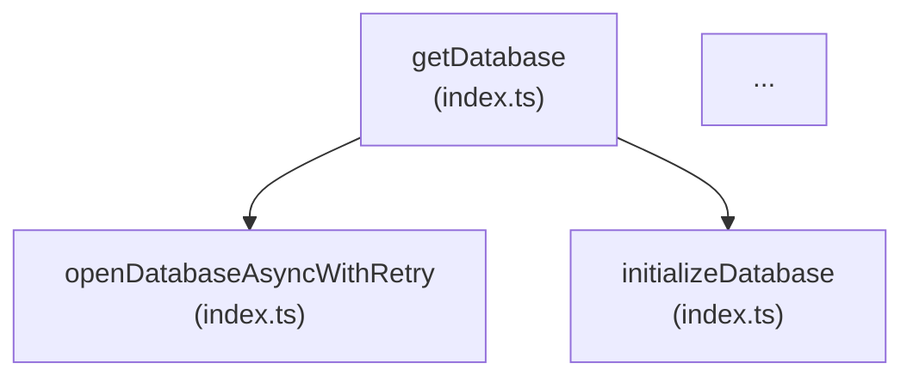

# Mermaid Call Graph Chart Generator

**Date:** 2026-05-03
**Status:** Approved

## Overview

A Node.js script (`scripts/generate-charts.js`) that reads the CodeGraph SQLite database and emits auto-generated Mermaid call graph diagrams into `docs/flowcharts/`, one file per source module folder.

## Trigger

Manual only. Run via:

```
npm run docs:charts
```

Only the developer with CodeGraph initialized (`.codegraph/codegraph.db`) can generate charts. No CI integration at this time.

## Modules Charted

One output file per module folder:

| Output file | Source folder |
|---|---|
| `docs/flowcharts/database.md` | `src/database/` |
| `docs/flowcharts/services.md` | `src/services/` |
| `docs/flowcharts/hooks.md` | `src/hooks/` |
| `docs/flowcharts/machines.md` | `src/machines/` |
| `docs/flowcharts/components.md` | `src/components/` |

## Data Flow

1. Open `.codegraph/codegraph.db` read-only via `better-sqlite3`
2. For each module, query all `function`-kind nodes where `file_path` matches `src/{module}/%`
3. BFS from each node, following `calls` edges up to **3 hops**, collecting `(source_name, source_file, target_name, target_file)` tuples
4. Filter out edges where target `file_path` is outside `src/` (exclude external lib calls)
5. Deduplicate edges via a `Set` of `source_id→target_id` pairs
6. Sanitize node names to `[A-Za-z0-9_]` for Mermaid compatibility
7. Write/overwrite `docs/flowcharts/{module}.md`
8. Write/overwrite `docs/flowcharts/README.md`

## Output Format

### Module file (`docs/flowcharts/database.md`)

```markdown
# database call graph

_Auto-generated. Run `npm run docs:charts` to regenerate._


```

Node IDs are `sanitizedFunctionName_sanitizedFilename` to handle duplicate function names across files. Labels show `functionName\n(file.ts)`.

### README (`docs/flowcharts/README.md`)

Explains:
- Charts are auto-generated, do not edit manually
- How to regenerate (`npm run docs:charts`)
- Requirements: `.codegraph/codegraph.db` must exist (run `codegraph index` to build/refresh), `better-sqlite3` in devDependencies
- What each file covers

## Error Handling

| Condition | Behavior |
|---|---|
| `.codegraph/codegraph.db` missing | Exit with message: `"CodeGraph not initialized. Run: codegraph init -i"` |
| Module has zero function nodes | Skip module, log warning, no file written |
| Circular call chains | BFS visited-set prevents infinite loop |
| Mermaid special characters in names | Sanitize: replace non-`[A-Za-z0-9_]` with `_` |

## Dependencies

- `better-sqlite3` — add to `devDependencies`
- No new runtime dependencies
- Prerequisite: `.codegraph/codegraph.db` must exist (run `codegraph index` if missing)

## npm script

```json
"docs:charts": "node scripts/generate-charts.js"
```
